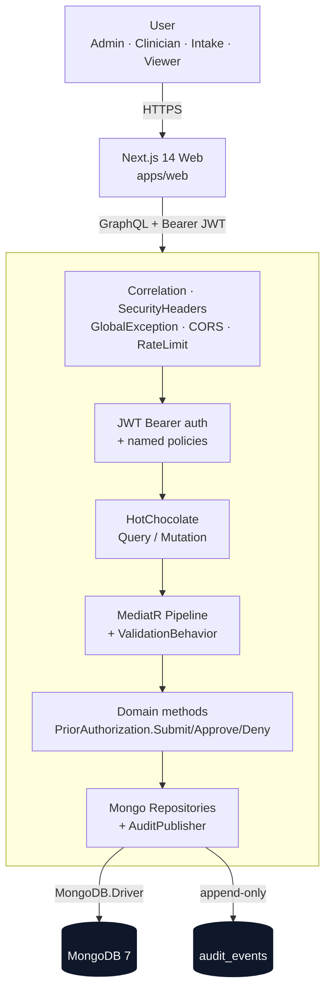
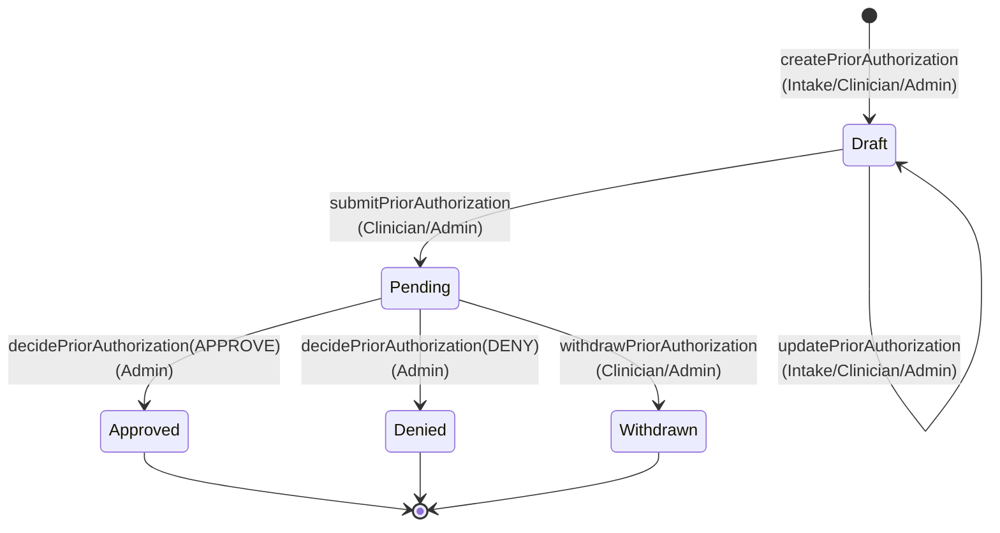
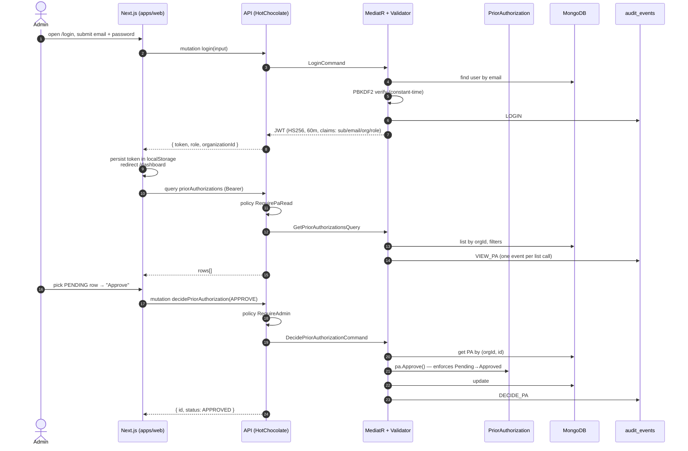
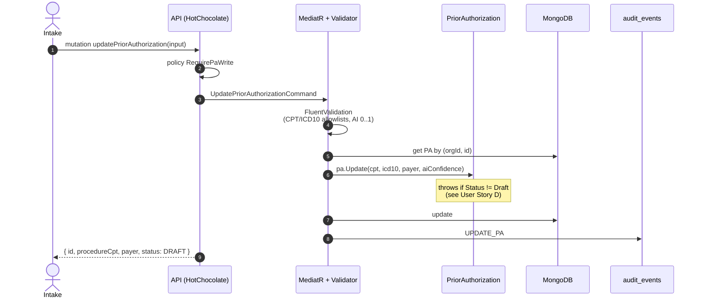

# SerenAuth — End-to-End Process

> Companion to the README. This document describes how a prior authorization
> moves through the system from sign-in to a final decision, with a focus
> on which layer enforces which guarantee.

---

## 1. Request lifecycle (high level)



A typical request crosses **five enforcement layers** before it can mutate
state:

| Layer | What it enforces | Where |
| --- | --- | --- |
| Middleware | Correlation id, security headers, problem-details errors | `src/SerenAuth.Api/Middleware/` |
| Rate limit | Per-IP fixed window | `Program.cs` (RateLimit__*) |
| AuthN | JWT HS256 with issuer + audience validation | `Program.cs` AddJwtBearer |
| AuthZ | Named policies — role + `org` claim | `Api/Authorization/Policies.cs` |
| Domain | State-machine transition rules + value-object validation | `Domain/Entities/PriorAuthorization.cs` |

The handler always reads `currentUser.OrganizationId` from the JWT — never
from the client payload — so a request cannot widen its tenant scope.

---

## 2. Prior authorization state machine



Three terminal states, three different stories: **Approved** and **Denied**
record what the payer decided; **Withdrawn** records what the *clinic*
decided when the submission turned out to be wrong (wrong patient, wrong
CPT, double-submit). Keeping them as distinct terminal states means a
compliance review can answer "how many PAs did the payer actually deny?"
without conflating it with our own retractions.

The `Draft → Draft` self-transition is intentional: edits are allowed
*only* while the PA is still a draft. Once `Submit()` flips it to
`Pending`, the entity refuses further `Update()` calls — the payer
always sees what was submitted, not a later rewrite.

Each transition is a domain method on `PriorAuthorization` — the entity is
the only thing that can change its own status, and illegal transitions
throw `InvalidOperationException` which the global exception filter
surfaces as an RFC 7807 problem.

---

## 3. End-to-end "happy path" — sign in → approve



---

### 3a. Edit-then-submit path

A draft is rarely correct on the first pass. Intake users frequently
need to fix a CPT code or swap a payer after the clinician reviews the
chart. The edit path mirrors the create path closely — same value-object
validation, same `RequirePaWrite` policy — but is gated by the entity's
Draft-only invariant.



Notice the placement of the Draft-only check: it lives on the **entity**,
not on the policy. That's deliberate — the policy answers *who can call
the operation*, the entity answers *whether the operation is valid right
now*. Putting both checks in one layer would let either a route refactor
or a policy tweak silently re-open the edit window after submission.

### 3b. Audit-read path

The append-only audit collection is the system's compliance backbone — but
until an admin can read it back, the "trust me, it's logged" promise is
paper-only. The `auditEvents` query closes that loop. It's gated by
`RequireAdmin` (same policy as PA decision: the most powerful read sits
behind the most restrictive role) and is **always** scoped to the caller's
organization by the handler, not by the client.

```mermaid
sequenceDiagram
    autonumber
    actor Admin
    participant API as API (HotChocolate)
    participant Med as MediatR + Validator
    participant Mongo as MongoDB

    Admin->>API: query auditEvents(action, since, limit)
    API->>API: policy RequireAdmin
    API->>Med: GetAuditEventsQuery
    Med->>Med: validate (limit 1..500, since not in future)
    Med->>Mongo: find audit_events where<br/>orgId == caller.org<br/>[+ action / since]<br/>sort by timestamp desc, limit
    Note over Med,Mongo: uses ix_audit_org_ts;<br/>no cross-tenant read is possible
    API-->>Admin: AuditEventDto[]
```

Two intentional non-features:

1. **No `VIEW_AUDIT` event is emitted by the read.** Logging every audit
   read would inflate the log and create a weird feedback shape ("the
   audit log shows that the audit log was read"). If we ever need
   read-side accountability, it belongs in middleware, not the handler.
2. **No cross-tenant escape hatch.** Even a global-admin role wouldn't
   bypass org scoping — there's no resolver argument that widens it.

## 4. Role / policy matrix

| Operation | Policy | Viewer | Intake | Clinician | Admin |
| --- | --- | :-: | :-: | :-: | :-: |
| `login` | (none, public) | ✓ | ✓ | ✓ | ✓ |
| `priorAuthorizations` query | `RequirePaRead` | ✓ | ✓ | ✓ | ✓ |
| `patients` / `providers` | `RequireOrgScope` | ✓ | ✓ | ✓ | ✓ |
| `createPriorAuthorization` | `RequirePaWrite` | — | ✓ | ✓ | ✓ |
| `updatePriorAuthorization` (Draft only) | `RequirePaWrite` | — | ✓ | ✓ | ✓ |
| `submitPriorAuthorization` | `RequirePaSubmit` | — | — | ✓ | ✓ |
| `withdrawPriorAuthorization` | `RequirePaSubmit` | — | — | ✓ | ✓ |
| `decidePriorAuthorization` | `RequireAdmin` | — | — | — | ✓ |
| `auditEvents` query | `RequireAdmin` | — | — | — | ✓ |

All policies additionally require an `org` claim — a token without one is
treated as unauthenticated for org-scoped operations.

---

## 5. Audit trail

Every state-changing operation publishes an `AuditEvent` to an
append-only collection:

| Action | Emitted by |
| --- | --- |
| `LOGIN` | `LoginHandler` |
| `CREATE_PA` | `CreatePriorAuthorizationHandler` |
| `UPDATE_PA` | `UpdatePriorAuthorizationHandler` (Draft-only) |
| `SUBMIT_PA` | `SubmitPriorAuthorizationHandler` |
| `WITHDRAW_PA` | `WithdrawPriorAuthorizationHandler` |
| `DECIDE_PA` | `DecidePriorAuthorizationHandler` |
| `VIEW_PA` | `GetPriorAuthorizationsHandler` (one per list call) |

`audit_events` is indexed on `(organizationId, timestamp desc)` so a
compliance review can pull a tenant's full activity in chronological
order without a collection scan.

PHI is never logged. Structured logs carry the correlation id and the
user/org id only; the body of the PA never leaves the database.

Admins read the audit log through the `auditEvents` GraphQL query
(see §3b). The read path is org-scoped server-side, supports optional
`action` and `since` filters, and is capped at `limit ≤ 500`. The
existing `ix_audit_org_ts` index keeps "newest N for my org" reads
cheap regardless of total volume.

---

## 6. Where the user stories live in code

| User story | Source | Tests |
| --- | --- | --- |
| **A** — Admin approves a pending PA | `Application/PriorAuthorizations/Handlers.cs` `DecidePriorAuthorizationHandler` | `tests/SerenAuth.IntegrationTests/DecidePriorAuthorizationTests.cs::Admin_can_approve_a_pending_prior_authorization` |
| **B** — Admin denies a pending PA | same handler, `PaDecision.Deny` branch | `DecidePriorAuthorizationTests.cs::Admin_can_deny_a_pending_prior_authorization` |
| Guardrail — Clinician cannot decide | policy `RequireAdmin` on `Mutation.DecidePriorAuthorization` | `DecidePriorAuthorizationTests.cs::Clinician_cannot_decide_a_prior_authorization` |
| **C** — Intake edits a draft PA | `Application/PriorAuthorizations/Handlers.cs` `UpdatePriorAuthorizationHandler`; domain `PriorAuthorization.Update` | `tests/SerenAuth.IntegrationTests/UpdatePriorAuthorizationTests.cs::Intake_can_edit_a_draft_prior_authorization` |
| **D** — Cannot edit after submit | domain invariant `Update` throws unless `Status == Draft` | `UpdatePriorAuthorizationTests.cs::Editing_a_submitted_prior_authorization_is_rejected` |
| **E** — Admin reads org's audit log | `Application/Auditing/GetAuditEventsHandler.cs`; resolver `Query.AuditEvents` | `tests/SerenAuth.IntegrationTests/AuditLogQueryTests.cs::Admin_can_read_their_organizations_audit_trail` |
| **F** — Cross-tenant isolation on audit read | repo `ListByOrganizationAsync` filter is mandatory; org id comes from JWT, not the request | `AuditLogQueryTests.cs::Admin_cannot_see_another_organizations_audit_events` |
| **G** — Clinician withdraws a Pending PA | `Application/PriorAuthorizations/Handlers.cs` `WithdrawPriorAuthorizationHandler`; domain `PriorAuthorization.Withdraw` | `tests/SerenAuth.IntegrationTests/WithdrawPriorAuthorizationTests.cs::Clinician_can_withdraw_a_pending_prior_authorization` |
| **H** — Cannot withdraw a terminal PA | domain invariant `Withdraw` throws unless `Status == Pending` | `WithdrawPriorAuthorizationTests.cs::Withdrawing_an_approved_prior_authorization_is_rejected` |

The integration tests boot the full API host against a Testcontainers
Mongo instance, so each one exercises the same five enforcement layers
listed at the top of this document.

---

## 7. Running the demo

```bash
cp .env.example .env  # if not already present
./infrastructure/scripts/dev-up.sh    # mongo + api + web on 3000/8080
```

Sign in at <http://localhost:3000/login> with a seeded account
(`admin@riverbend.example` / `ChangeMe!123`) and walk a PA through
DRAFT → PENDING → APPROVED to exercise the full flow.
